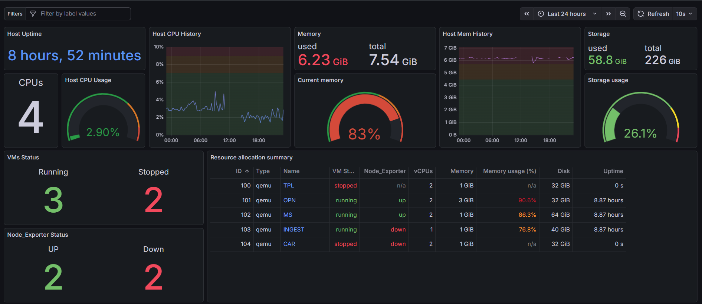
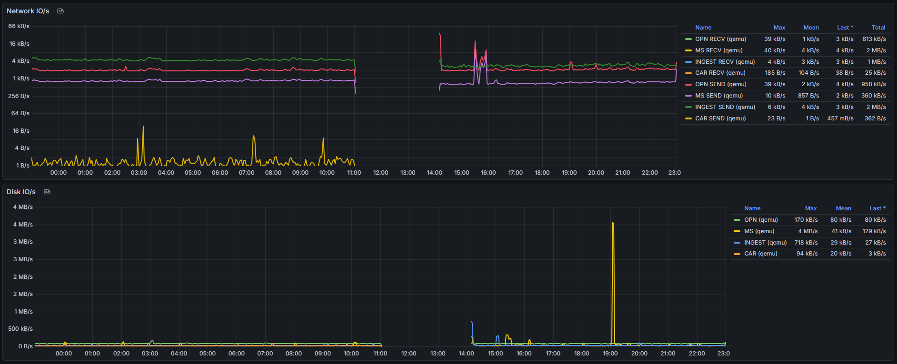
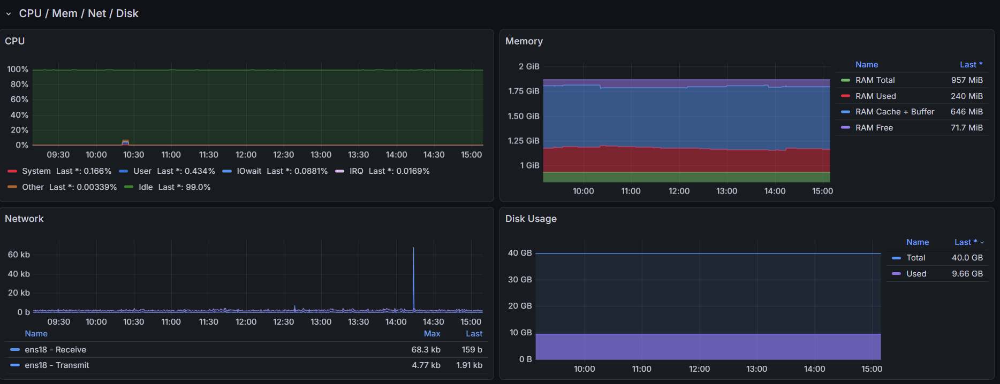

# 미니PC 홈서버 및 모니터링 구축

## 프로젝트 소개
인프라에 대한 실습 경험을 쌓기 위해 개인 홈서버와 모니터링 환경을 구축하였습니다.

## 프로젝트 구성
- **Host OS**: Proxmox VE  
- **VM 구성**: OPNsense (Firewall), 모니터링 VM (Grafana + Loki), 방화벽 로그 파싱 VM (Fluent Bit)  
- **네트워크**: 내부망 + VPN 접속만 허용  

## 아키텍처

## 프로젝트 구성

<h3>1. VM 모니터링</h3>

- #### 대시보드 화면
  - 전체 VM 정보
    
    
  - 개별 VM 상세 정보
    
    

- #### 내용
  - **접속 환경**
      - CloudFlared를 사용하여 VPN없이 도메인으로도 접속 가능하도록 설정하였습니다.
    
    - **metric 및 로그 수집**
      - Prometheus_pve_exporter로 Proxmox에 생성된 모든 VM들의 metric을 수집하도록 설정하였습니다.
      - 각 VM에는 node_exorter, fluent-bit, auditd를 설치하여 metric, 리눅스 시스템 보안과 일반 로그를 수집하도록 설정하였습니다.
      - 수집한 모든 정보들을 Prometheus로 전송하고, Grafana를 이용해 CPU 사용량, Uptime, Network I/O 등을 보여주는 대시보드를 생성하였습니다.
    
    - **대시보드별 설명**
      - 전체 VM 대시보드 : VM들의 metric 정보, 부팅 유무, 서버 이상 유무 등을 나타나도록 시각화하였습니다. 또한, 특정 VM의 이름을 클릭하면 해당 VM의 상세 정보를 보여주는 대시보드로 연결하였습니다.
      - 특정 VM 대시보드 : auditd를 통해 시스템 로그, 내부 

<h3>2. 방화벽 모니터링</h3>

- #### 대시보드 화면
  

- #### 내용
  - **접속 환경**
    - WireGuard VPN을 통해서만 내부망 접근이 가능하도록 설정하였습니다.
    - Proxmox GUI와 OPNsense GUI 또한 내부망으로 포함시켜 외부에서는 접근하지 못하도록 설정하였습니다.
  
  - **로그 수집 및 파싱**
    - Fluent Bit로 OPNsense의 방화벽 로그를 수집하고 21개의 필드로 파싱하였습니다.
    - `rule`, `subrule`, `anchor`, `rid`, `interface`, `reason`, `action`, `dir`, `ipversion`, `tos`, `ecn`, `ttl`, `id`, `offset`, `ipflags`, `protonum`, `proto`, `length`, `src`, `dst`, `else`
    - 수집한 로그를 Loki로 전송하고, Grafana를 이용해 차단된 Inbound 트래픽에 대한 모니터링 대시보드를 구성하였습니다.
  
  - **대시보드별 설명**
    - 국가별 접속 시도 현황 (Geomap): 차단된 Inbound 로그의 IP를 기반으로 접속 시도 국가를 지도에 시각화하였습니다.
    - 시간대별 트래픽 추이: 차단된 트래픽을 시간 흐름에 따라 그래프로 시각화하였습니다.
    - 실시간 로그 스트림: Loki로부터 전송받은 원본 로그를 실시간으로 나타나도록 하였습니다.

