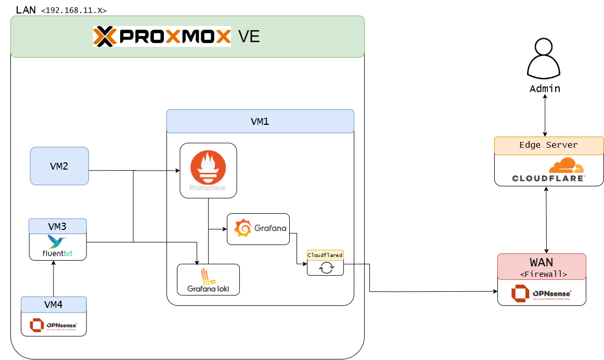

# 미니PC 홈서버 및 방화벽 로그 모니터링 구축

## 프로젝트 개요
Proxmox 기반 서버에 여러 가상머신(VM)을 구성하여 개인 홈서버 환경을 구축하고, 방화벽 로그 모니터링을 실습한 프로젝트입니다.  
내부망으로 모든 VM을 구성하여 VPN 접속만 허용하도록 설정하였습니다.
 VM은 총 3개로 **OPNsense VM**, **모니터링 VM(Grafan + Loki)**, **파싱 VM(Fluent Bit + PostgreSQL)** 입니다.

## 시스템 구성
- **호스트 OS:** Proxmox VE
- **가상머신 구성:**
  - **OPNsense VM** – 방화벽 및 VPN 서버 역할
  - **모니터링 VM** – Grafana + Loki 기반 시스템 로그 수집 및 시각화
  - **파싱 VM** – Fluent Bit를 사용하여 로그 수집 및 전달
- **네트워크:** 모든 VM 내부망 연결, VPN 접속으로만 접근 가능

## 아키텍처

## 프로젝트 구성
### 1. 모니터링 화면

### 2. 내용
  - **보안 설정**
    - WireGuard VPN을 통한 내부망 접근
    - Proxmox GUI와 OPNsense GUI 또한 VPN으로만 접근 가능하도록 설정
  
  - **모니터링 환경**
     - Fluent Bit로 OPNsens 방화벽 로그 수집
     - 수집한 로그를 Loki로 전송
     - Grafana 대시보드로 실시간 모니터링 구현

## 프로젝트 결과
- VPN을 통한 안전한 내부망 구성 완료
- Grafana 대시보드로 VM 상태와 로그 실시간 관제 가능
- CloudFlared를 통해 외부에서 VPN없이 URL로 접속 가능
- 인프라 운영에서 **보안과 모니터링의 중요성**을 실습 경험으로 체득

## ❗알게된 점들
- 미니PC + Proxmox 환경에서 VM 기반 인프라 구성과 운영 경험
- 클라우드 환경과 온프레미스 환경 차이 이해
- 인프라 운영에 있어 **보안, 모니터링, 안정성**의 중요성을 체득
