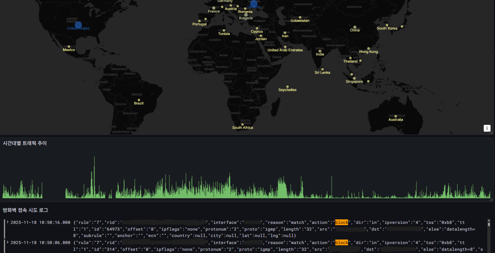

# 미니PC 홈서버 및 방화벽 로그 모니터링 구축

## 프로젝트 개요
Proxmox 기반 서버에 여러 가상머신(VM)을 구성하여 개인 홈서버 환경을 구축하고, 방화벽 로그 모니터링을 실습한 프로젝트입니다.  
내부망으로 모든 VM을 구성하여 VPN 접속만 허용하도록 설정하였습니다.
 VM은 총 3개로 **OPNsense VM**, **모니터링 VM(Grafan + Loki)**, **파싱 VM(Fluent Bit)** 입니다.

## 시스템 구성
- **호스트 OS:** Proxmox VE
- **가상머신 구성:**
  - **OPNsense VM** – 방화벽 및 VPN 서버 역할
  - **모니터링 VM** – Grafana + Loki 기반 시스템 로그 수집 및 시각화
  - **파싱 VM** – Fluent Bit를 사용하여 로그 수집 및 전달
- **네트워크:** 모든 VM 내부망 연결, VPN 접속으로만 접근 가능

## 아키텍처

## 프로젝트 구성
### 1. 대시보드 화면 (Last 24 hours)

### 2. 내용
  - **접속 환경 설정**
    - WireGuard VPN을 통해서만 내부망 접근이 가능하도록 설정하였습니다.
    - Proxmox GUI와 OPNsense GUI 또한 내부망으로 포함시켜 외부에서는 접근하지 못하도록 설정하였습니다.
  
  - **로그 수집 및 파싱**
     - Fluent Bit로 OPNsense의 방화벽 로그를 수집하고 21개의 필드로 파싱하였습니다.
     - `rulenr`, `subrulenr`, `anchorname`, `rid`, `interface`, `reason`, `action`, `dir`, `ipversion`, `tos`, `ecn`, `ttl`, `id`, `offset`, `ipflags`, `protonum`, `protoname`, `length`, `src`, `dst`, `else`
     - 수집한 로그를 Loki로 전송하고, Grafana를 이용해 차단된 Inbound 트래픽에 대한 모니터링 대시보드를 구성하였습니다.
  
  - **대시보드 주요 기능**
    - 국가별 접속 시도 현황 (Geomap): 차단된 Inbound 로그의 IP를 기반으로 접속 시도 국가를 지도에 시각화하였습니다.
    - 시간대별 트래픽 추이: 차단된 트래픽을 시간 흐름에 따라 그래프로 시각화하였습니다.
    - 실시간 로그 스트림: Loki로부터 전송받은 원본 로그를 실시간으로 나타나도록 하였습니다.

## ❗알게된 점들
- 미니PC + Proxmox 환경에서 VM 기반 인프라 구성과 운영 경험
- 클라우드 환경과 온프레미스 환경 차이 이해
